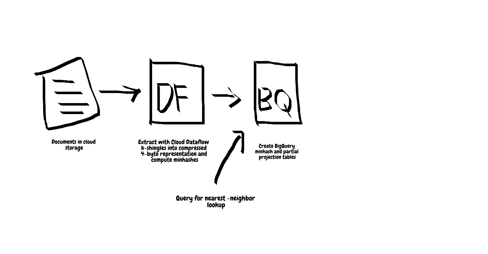

minhash-service
----


[](https://travis-ci.org/4d55397500/minhash-service)


A large scale managed min-hashing service for documents. 


### Background
See the wikipedia [article](https://en.wikipedia.org/wiki/MinHash) on min-hashing.

### Design
A Google Cloud Dataflow job converts documents to minhash representations and stores those representations along with partial minhash projections in BigQuery tables.  The documents are first tokenized as [shingles](https://github.com/4d55397500/minhash-service/blob/9d9dae3508e8859527f47f67de27fc4bc2e19f29/src/main/kotlin/MinHash.kt#L313-L318), with shingles compressed to a [4-byte representation](https://github.com/4d55397500/minhash-service/blob/9d9dae3508e8859527f47f67de27fc4bc2e19f29/src/main/kotlin/MinHash.kt#L324-L326). The resulting two BigQuery tables facilitate a [nearest neighbor search](https://github.com/4d55397500/minhash-service/blob/9d9dae3508e8859527f47f67de27fc4bc2e19f29/src/main/kotlin/LocalSearch.kt#L14-L31) as a join, filter and then group by. See the example [local search](./docs/local_search.md).





### API
There are two primary api operations: 
 1) converting documents to minhashes and persisting
 2) nearest neighbor lookup for each of a given subset of documents

 See the [API doc](docs/api.md).
 

### Running tests
```
 
./gradlew test

```

### To Do
Add a UI.

### License

This project is licensed under the MIT License - see the [LICENSE.md](LICENSE.md) file for details


#### *Note*
This system demonstrates minhashing for large scale document search. A modern approach using deep learning might be training embeddings and using a nearest neighbor index on the vector representations for lookup.


