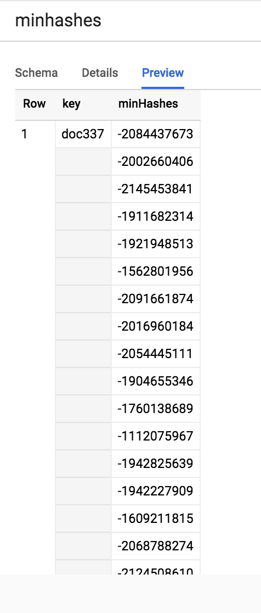
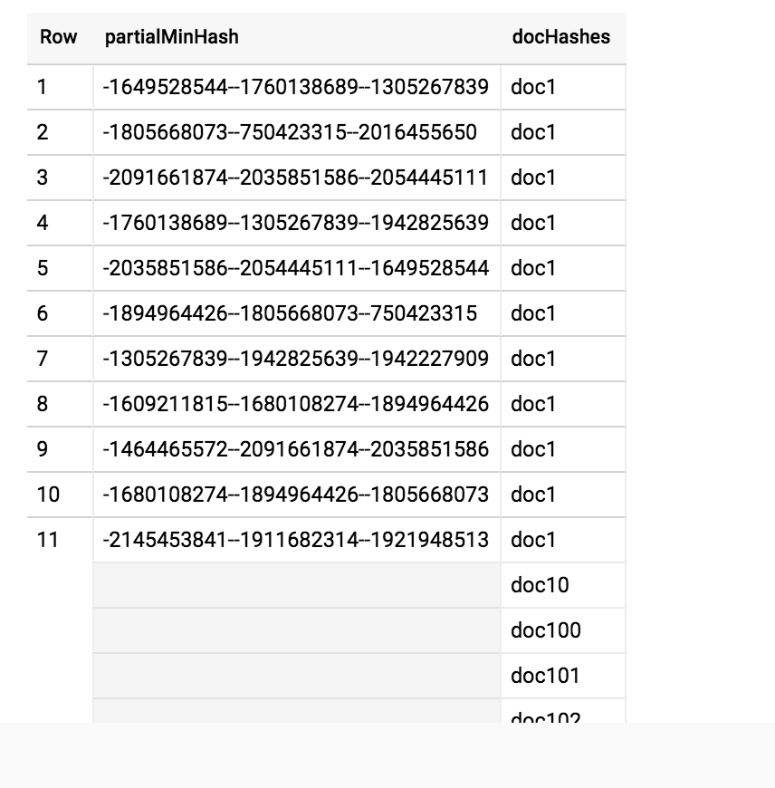

min-hash
----

[](https://travis-ci.org/4d55397500/minhash-service)

A large scale min-hashing service for documents. Currently a Google Cloud Dataflow job converts to documents to minhash representations and stores those representations along with partial projections for 'hashmap lookup' in BigQuery tables. 

A form of [nearest neighbor search](https://github.com/4d55397500/minhash-service/blob/9d9dae3508e8859527f47f67de27fc4bc2e19f29/src/main/kotlin/LocalSearch.kt#L14-L31) is implemented directly in BigQuery.

### Background
See the wikipedia [article](https://en.wikipedia.org/wiki/MinHash) on min-hashing.

### Design
[Shingles](https://github.com/4d55397500/minhash-service/blob/9d9dae3508e8859527f47f67de27fc4bc2e19f29/src/main/kotlin/MinHash.kt#L313-L318) are computed for each document, compressed to a [4-byte representation](https://github.com/4d55397500/minhash-service/blob/9d9dae3508e8859527f47f67de27fc4bc2e19f29/src/main/kotlin/MinHash.kt#L324-L326). Minhashes are computed and stored along with a 'hashmap' reprentation in two BigQuery tables, as shown below.

One with the min hashes




The other with min hash projections for looking up neighbors (similar documents)



(nice architecture doodle goes here)

### Run

instructions to be added


### API
----


* **URL**

  `/dataflow`

* **Method:**
  

	`POST`
  
*  **URL Params**

   **Required:**
 	    
   **Optional:**
 

* **Data Params**

	```
	[
	 { key: 'fooKey',
	   documentPath: 'gs://.../doc.txt'
	 },
	 ...
	]
	```
* **Sample Call:**

	```
	POST http://localhost:8080/dataflow
	Content-Type: application/json
	
	[
	 { key: 'fooKey',
	   documentPath: 'gs://.../doc.txt'
	 },
	 ...
	]
	```
* **Response:**

--

* **URL**

  `/localsearch`

* **Method:**
  

	`POST`
  
*  **URL Params**

   **Required:**
 	    
   **Optional:**
 

* **Data Params**

	```
	["docKey1", "docKey2", ...]
	```
* **Sample Call:**

	```
	POST http://localhost:8080/localsearch
	Content-Type: application/json
	
	["docKey1", "docKey2", ...]
	```
* **Response:**

	```
	{"doc301":[{"docKey":"doc483","score":7},{"docKey":"doc318","score":7},{"docKey":"doc773","score":6},{"docKey":"doc768","score":6},
	...
	```
